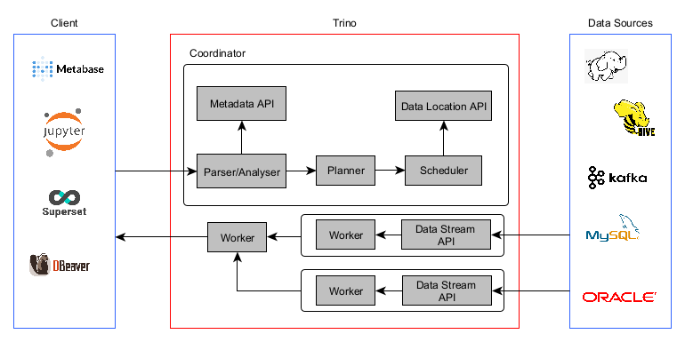
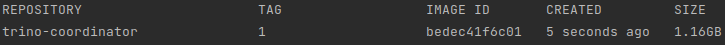
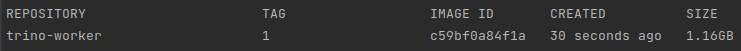
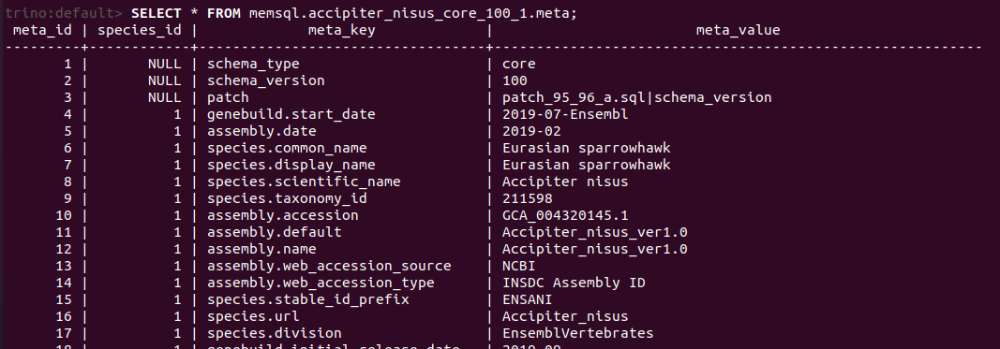
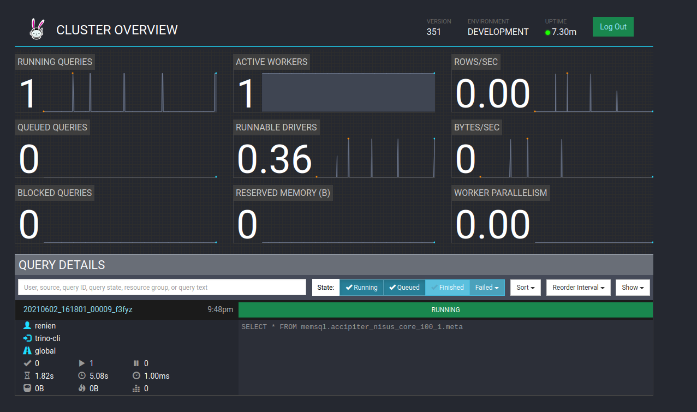
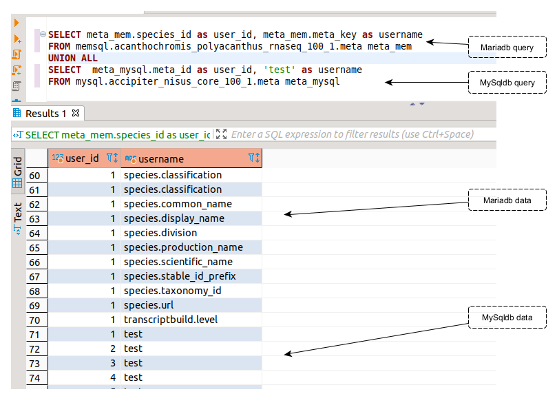

# Trino POC Project

Trino is a distributed SQL query engine designed to query large data sets distributed over one or more heterogeneous data sources.



## Build - trino-base

```shell
sudo docker build --build-arg "VERSION=351" -t "trino:1"
```
```shell
cd <navigate to trino-coordinator folder>
sudo docker build --build-arg VERSION=1 -t "trino-coordinator:1" .
```



```shell
cd <navigate to trino-worker folder>
sudo docker build --build-arg VERSION=1 -t "trino-worker:1" .
```



All the above commands are wrapped inside `build.sh`

```shell
sudo bash build.sh
```

## Deploy Trino

```shell
# UP
sudo trino_VERSION=1 docker-compose up

# DOWN
sudo trino_VERSION=1 docker-compose down
```

## Testing MySql Connector

Execute the trino-cli
```shell
./trino --server localhost:8080 --catalog mysql --schema default
```

Once the cli is open query the MySQL
```sql
SHOW SCHEMAS FROM mysql;
SHOW TABLES FROM mysql.accipiter_nisus_core_100_1;
SELECT * FROM mysql.accipiter_nisus_core_100_1.meta;
```

## Testing MariaDB Connector

Execute Trino-cli
```shell
./trino --server localhost:8080 --catalog memsql --schema default
```

Once the cli is open query the MariaDB
```sql
SHOW SCHEMAS FROM memsql;
SHOW TABLES FROM memsql.accipiter_nisus_rnaseq_100_1;
SELECT * FROM memsql.accipiter_nisus_core_100_1.meta;
```

### Sample Result


### Trino Coordinator UI


## Testing Federated Queries

Trino retrieves data from two different data sources from the same query..

```sql
SELECT meta_mem.species_id as user_id, meta_mem.meta_key as username
FROM memsql.acanthochromis_polyacanthus_rnaseq_100_1.meta meta_mem
UNION ALL
SELECT  meta_mysql.meta_id as user_id, 'test' as username
FROM mysql.accipiter_nisus_core_100_1.meta meta_mysql
```

